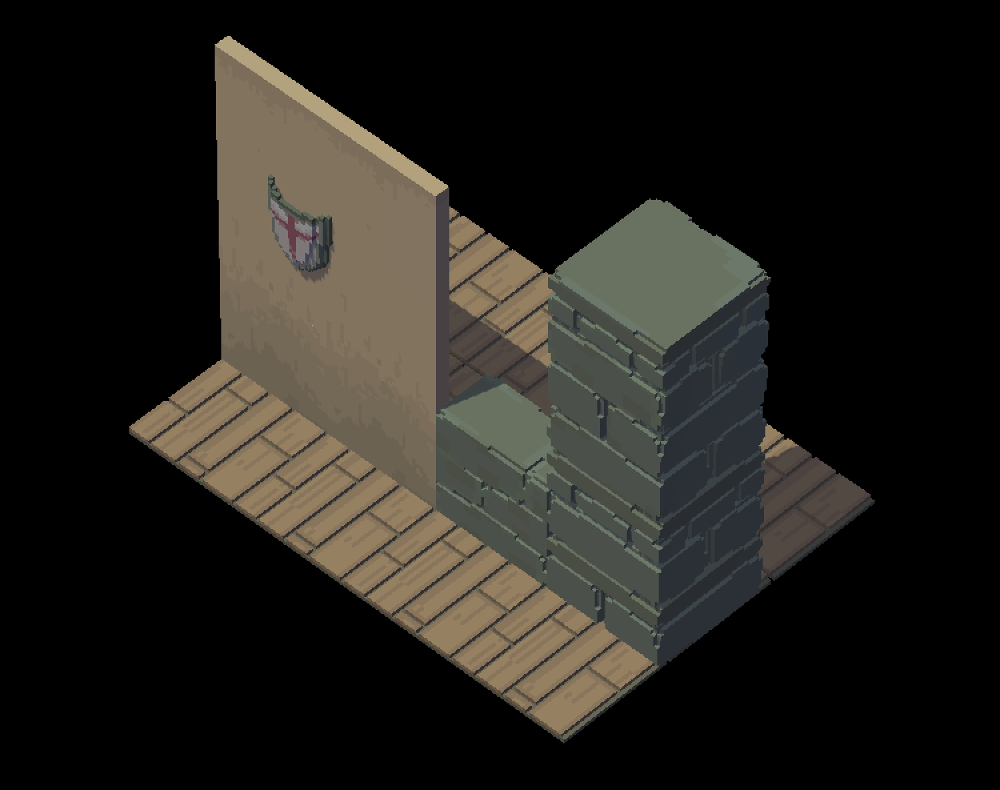

# Voxel Raymarching
A package providing pack of shaders and managed scripts to visualize volumetric data (3D array of voxels) as solid geometry. Rendering tidly connected with unity PBR pipeline for seamless integration into polygonal scenes



## Requirements

1) Unity 2018.1 or newer
2) Package Manager

## Usage

1. Open your `Packages/manifest.json` file in root of your Unity project.
2. Add dependency: 
```
cc.aofg.voxel-raymarching": "git://github.com/aofg/voxel-raymarching.git
```
3. Switch to editor and wait for package resolve
4. ~~Open sample scene at `Packages/Voxel Raymarcing/SamplesScene.scene`~~ (not ready yet)

## Roadmap

- [x] Draft implementation with hardcoded values
- [x] Integration with Standard shader
    - [x] Proper lighting
    - [x] Shadows
- [ ] PBR params decoder from color data (encoding convention is required!)
- [ ] Parametrization
    - [x] Volume Size (bounds of providen volume)
    - [ ] LOD (skip N pixel from providen texture)
    - [ ] Adjust bounding (render) box to perfect fit volume size (overdraw minimization)
- [ ] Implementation of fancy effects
    - [ ] Neighbourhood Ambient Occlusion ("vertex ao")
    - [ ] Raycasted Ambient Occlusion
    - [ ] Light flood (GI)
    - [ ] Reflections
- [ ] StructuredBuffer Rendering Pipeline
    - [x] Draft implementation
    - [ ] Memory pointer map implementation
